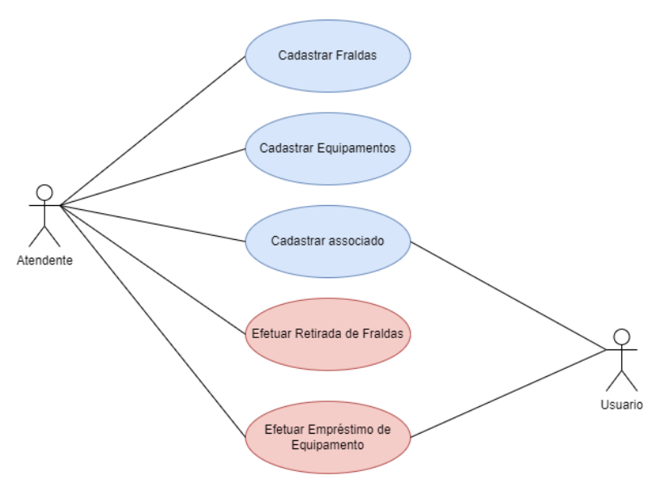

# ANPEDE - Associação Naviraiense de Pessoas com Deficiência

A associação realiza doações de fraldas geriátricas para os associados e empréstimos de equipamentos para mobilidade e acessibilidade como cadeira de rodas, cadeira de banho entre outros.

## Visão Geral
O associado poderá acessar o aplicativo e solicitar fraldas geriátricas, ele deverá indicar quantas unidades necesitará no mês, o atendente deverá responder verificar o estoque e agendar a retirada.
Qualquer pessoa poderá solicitar o empréstimo de equipamentos, poderá agendar a retirada e deverá informar o motivo da solicitação. Não poderá solicitar empréstimos do mesmo tipo de equipamento sem a prévia devolução.

## Funcionalidades Principais
- Cadastrar Associado
- Cadastrar Fraldas
- Cadastrar Equipamentos
- Efetuar Retirada de Fraldas
- Efetuar Empréstimo de Equipamentos

## Tecnologias Utilizadas

  

## Estudo de Casos
### Diagrama de Casos de Uso
  
  
### Diagrama de Classes
  

